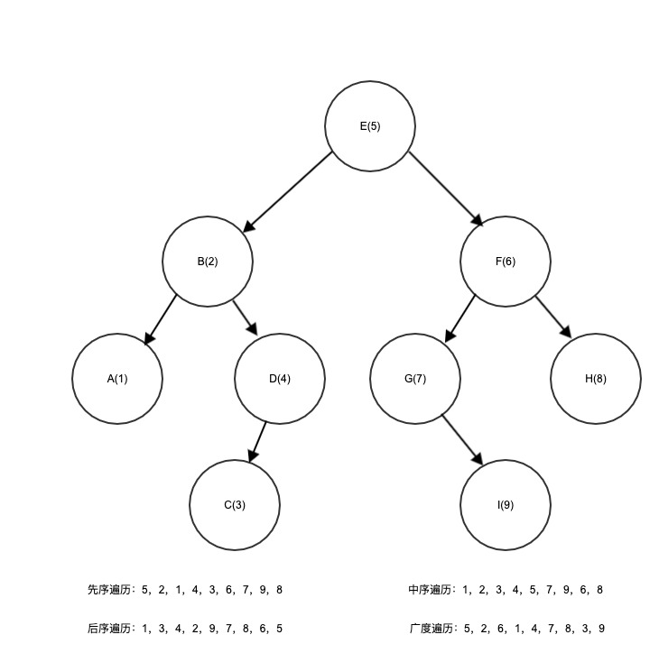

# 二叉树遍历

## 深度遍历
### 前序遍历
前序遍历是先根再左后右。
> 原理：通过递归实现。先输出根节点，然后一次递归左孩子，再递归右孩子。

### 中序遍历
中序遍历是先左再根后右
> 原理：通过递归实现。先递归左孩子，然后输出根节点，再递归右孩子。

### 后续遍历
后序遍历是先左再右后根
> 原理：通过递归实现。先递归左孩子，然后递归右孩子，再输出根节点。

## 广度优先
### 层级遍历
> 原理：通过队列实现。根入队列。判断队列不为空，队列前端出队列，打印出队列的节点并将该节点的左右孩子依次入队。循环该步骤直到队列为空。
